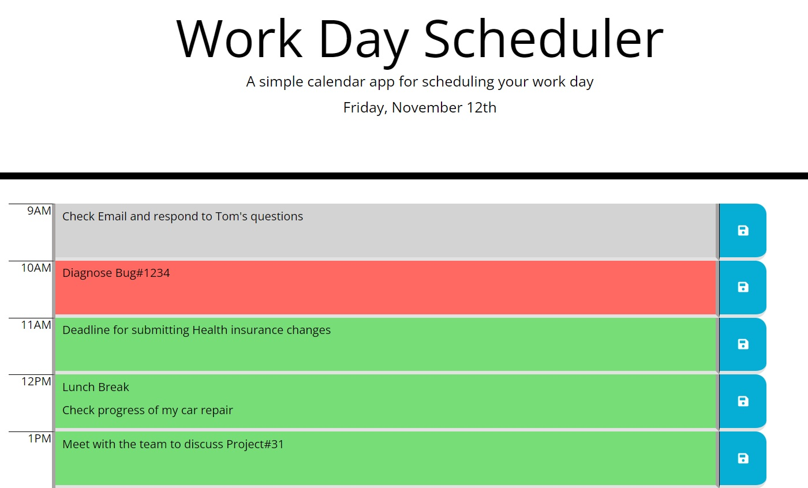

# Work Day Scheduler

## Description
This App is used to list "to dos" or activities for the day with work hours between 9:00AM - 5:00PM. The hours are color-coded whether it is the current, past or future.

## Tech/Framework
* HTML
* CSS
* JavaScript
* jQuery
* Bootstrap
* Moment.js
* Font Awesome icon

## Technical Requirements
* Display current date in this format: e.g. Friday, November 12th.
* Work day start at 9:00 AM and ends at 5:00 PM.
* Time blocks are color-coded when it is past, current or future hour.
* Save the list in the localStorage when save button is clicked in the corresponding hours.

## Screenshots
* Screen 1   
* Screen 2   

## Work Day Scheduler App Link
[Check what is up for today](https://jojobautistaum.github.io/work-day-scheduler/)

